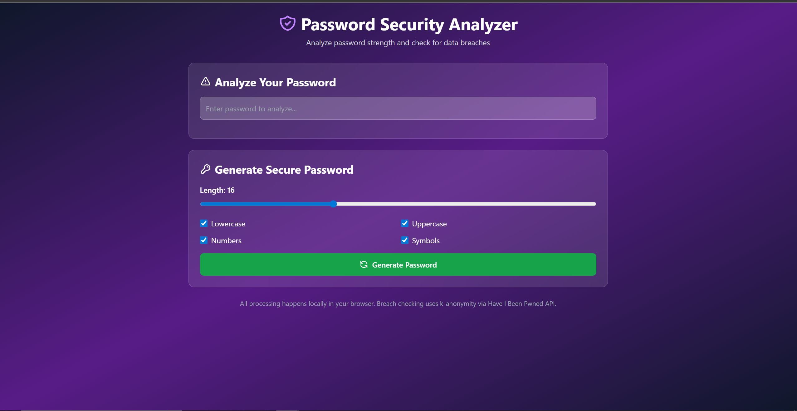

# 🔐 Password Security Analyzer

A client-side password security tool that analyzes password strength and checks against known data breaches using the Have I Been Pwned API.



## ✨ Features

- **⚡ Real-time Password Strength Analysis**
  - 🧮 Calculates entropy based on character variety
  - 🔍 Checks for common patterns and repeated characters
  - 📊 Visual strength meter with color-coded feedback
  - 💡 Specific suggestions for improvement

- **🚨 Breach Database Checking**
  - 🔒 Uses k-anonymity to protect privacy
  - 📚 Checks against 800+ million breached passwords
  - 🌐 Powered by Have I Been Pwned API

- **🎲 Secure Password Generator**
  - 🔐 Cryptographically secure random generation
  - 📏 Customizable length (8-32 characters)
  - 🎛️ Toggle character types (uppercase, lowercase, numbers, symbols)
  - 📋 One-click copy to clipboard

## 🛡️ Security & Privacy

- **💻 100% Client-Side**: All password analysis happens locally in your browser
- **🚫 No Data Storage**: Passwords are never stored or transmitted
- **🕵️ K-Anonymity**: Breach checking uses k-anonymity - only the first 5 characters of the SHA-1 hash are sent to the API
- **🔐 HTTPS Only**: All external requests use secure HTTPS connections

## 🛠️ Technologies Used

- HTML5
- Vanilla JavaScript (ES5 compatible)
- Tailwind CSS
- Web Crypto API
- Have I Been Pwned API

## 🧠 How It Works

### 💪 Password Strength Calculation
The tool evaluates passwords based on:
- 📐 Length (minimum 12 characters recommended)
- 🎨 Character variety (uppercase, lowercase, numbers, symbols)
- 🎲 Entropy calculation (bits of randomness)
- 🚩 Common pattern detection (123, abc, qwerty, etc.)
- 🔁 Repeated character detection

### 🕵️‍♂️ Breach Checking with K-Anonymity
1. 🔢 Password is hashed using SHA-1
2. ✂️ Only the first 5 characters of the hash are sent to the API
3. 📥 API returns all hash suffixes matching that prefix
4. 🔍 Client-side comparison finds exact match
5. ✅ This ensures your actual password never leaves your browser

## 🚀 Live Demo

[View Live Demo](https://yourusername.github.io/password-security-analyzer) 👈 Click here!

## 📦 Installation

Simply clone the repository and open `index.html` in a web browser:
```bash
git clone https://github.com/yourusername/password-security-analyzer.git
cd password-security-analyzer
open index.html
```

Or deploy to GitHub Pages for a live hosted version! 🌟

## 🎓 Educational Purpose

This project demonstrates:
- 🔐 Practical application of cryptographic concepts
- 🌐 API integration with privacy-preserving techniques
- 💻 Client-side security implementation
- 🎨 User-friendly security tool design

## 🤝 Contributing

Contributions are welcome! Feel free to submit issues or pull requests. 💖

## 📄 License

MIT License - feel free to use this project for learning and portfolio purposes.

## 🙏 Acknowledgments

- [Have I Been Pwned](https://haveibeenpwned.com/) for the breach database API 🌐
- [Troy Hunt](https://www.troyhunt.com/) for creating HIBP and the k-anonymity implementation 🦸‍♂️
